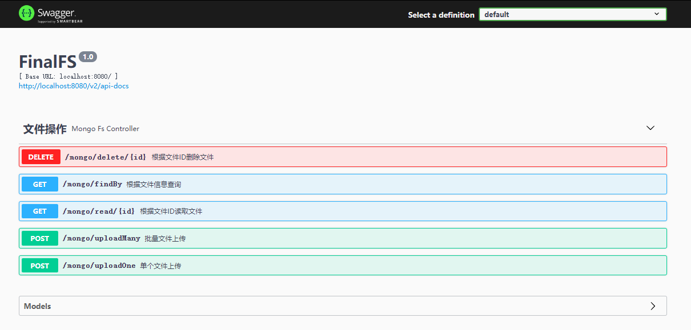

# FinalFS

### 作为一个可拔插的组件，提供文件上传、文件读取功能。支持在线对文件进行管理。

---

## 模块 —— `fs-mongo`

- 基于 Mongo GridFS 实现

- 已实现功能
  - 文件上传（含批量上传）
  - 文件检索（文件名字、自定义文件类型）
  - 文件读取（自动适配ContentType）
  - 文件删除

- 首页 [http://localhost:8080](http://localhost:8080)
- Swagger [http://localhost:8080/swagger-ui.html](http://localhost:8080/swagger-ui.html)

- Docker镜像 [amos0626/fs-mongo](https://hub.docker.com/r/amos0626/fs-mongo)
    - [Dockerfile](fs-mongo/Dockerfile)
    - 与mongo编排，可参考 [docker-compose.yml](fs-mongo/docker-compose.yml)

- 效果图

  

  

## 模块 —— `fs-sftp`

- 基于 sftp & commons-pool2 实现

- 已实现功能
  - 文件上传
  - 文件查询
  - 文件读取

- 文件上传、读取功能还是推荐使用 `fs-mongo`

---

[附录](doc/others.md)