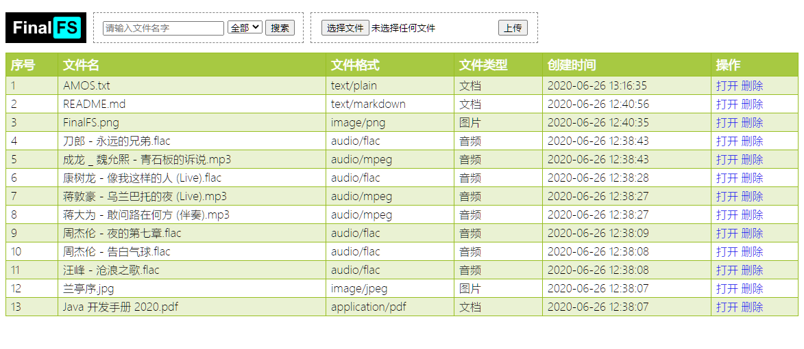
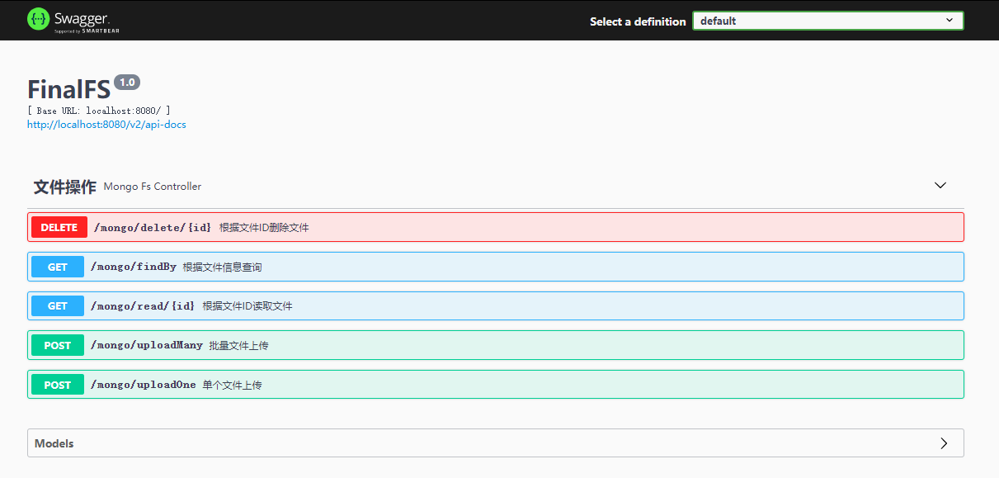

# Fs-Mongo

- 首页：http://localhost:8080
- Swagger：http://localhost:8080/swagger-ui.html
- Docker镜像：https://hub.docker.com/r/amos0626/fs-mongo
    - [Dockerfile](../../fs-mongo/Dockerfile)
    - 与mongo编排，可参考 [docker-compose.yml](../../fs-mongo/docker-compose.yml)
- 效果图
  
  

### Windows 安装 MongoDB

- 下载安装包，傻瓜式安装

  https://www.mongodb.com/try/download/community

- 进入安装目录下的 bin 目录
- 启动（注意是 mongod，不是 mongo）
    - 执行命令：`mongod -dbpath E:\app_res\mongodb\data`
    - 必须加上 `--dbpath`
    - [启动脚本](mongo_start.bat)
- 测试启动
    - http://localhost:27017/
- 查看操作命令
    - 执行命令：`mongo`
    - 查看帮助：`help`
